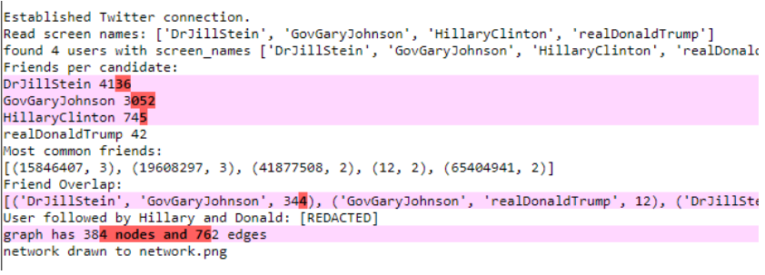
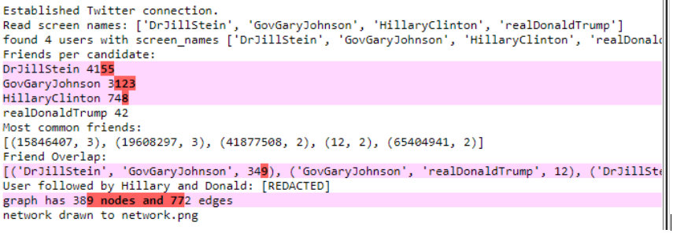
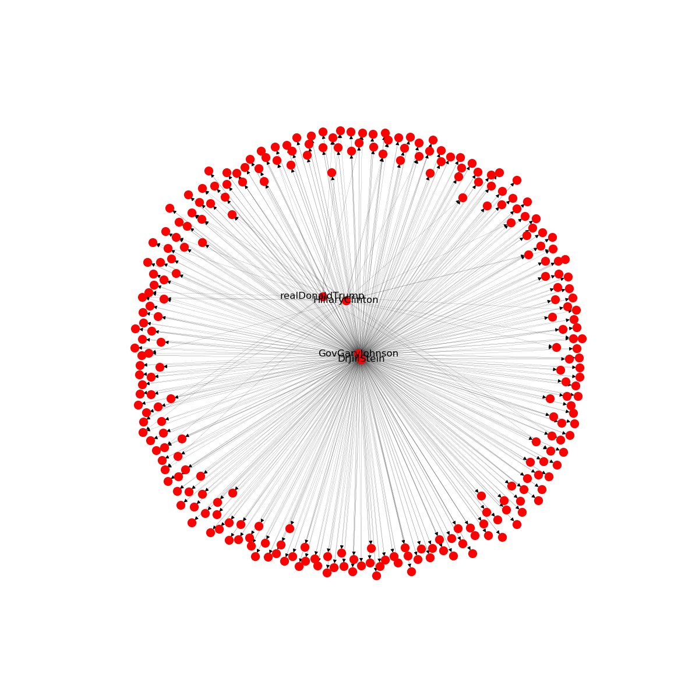

# influentialLeaderDetection

Determines the influence and popularity of a political leader by calculating the user's spread of communication with the help of retweets. 

The goal is to use the Twitter API to construct a social network of these
accounts. We will then use the [networkx](http://networkx.github.io/) library
to plot these links, as well as print some statistics of the resulting graph.

# How to Run

1. Create an account on [twitter.com](http://twitter.com).
2. Generate authentication tokens by following the instructions [here](https://dev.twitter.com/docs/auth/tokens-devtwittercom).
3. Add your tokens to the key/token variables below. (API Key == Consumer Key)
4. Be sure you've installed the Python modules
[networkx](http://networkx.github.io/) and
[TwitterAPI](https://github.com/geduldig/TwitterAPI).

p0.py - I used this initially to check whether the connection with the api was successfull. This file is also responsible for collecting the user dataset, given a seed user and storing it in twitteridsnew.txt. 

candidates.txt - This is a redundant text file with the initial contents of candidates.

# ScreenShots

